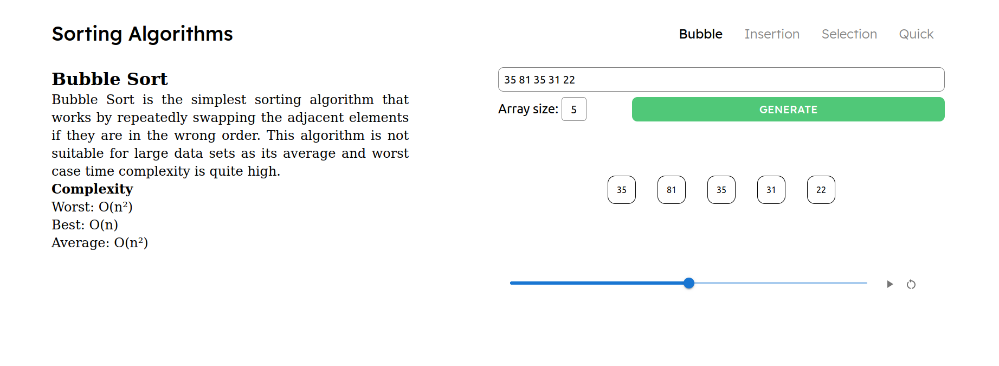

# Sorting Algorithms Visualization

This is our final web (React) project. It visualizes some of the most popular sorting algorithms:

- Bubble Sort
- Insertion Sort
- Selection Sort
- Quick Sort
- Merge Sort

## Team

Karyna Volokhatiuk, Olya Liuba, Bohdan Ruban, Mykhailo Sobko, Inna Zhurba, Daria Kuzmina.

## Installation

To be able to use our project, run following commands in terminal:

```console
web@lover:~$ git clone https://github.com/InnaZhurba/sorting_algorithms_visualization.git
web@lover:~$ cd sorting_algorithms_visualization
web@lover:~/sorting_algorithms_visualization$ npm install
web@lover:~/sorting_algorithms_visualization$ npm install json-server
```

If you have json-server installed, you can skip the 4th step of the described process.

## Usage

After installing the project and requirements, run following commands to launch the application:

```console
web@lover:~/sorting_algorithms_visualization$ json-server --watch db.json --port 3004
web@lover:~/sorting_algorithms_visualization$ npm start
```

One of the pages with the visualization looks like this:



There are 2 ways to use our visualizer:

1. Input the size and choose to generate random array of such size;
2. Input your own values of the array entries. In such case there is no need to input the size of an array.

In both cases you can choose the speed of the visualization by scrolling the scrollbar at the bottom of the page.

To start or stop the visualization, press the play button near the scrollbar.

To replay the visualization from the beginning, press the restart button next to the play button.

## Important

Do not input non-integer values. The visualization does not work with floating point numbers or strings.

### Final Note

Thank you for using our visualizer! Enjoy sorting algorithms :)
